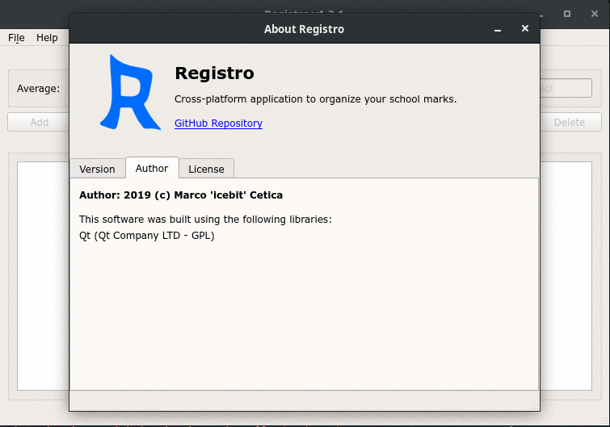

# Registro 
Registro is a multi-platform application to save and organize your school marks.  

# Installation
There are two ways to obtain Registro in your computer:
1. By compiling it from the source;
2. By downloading the executable file/installer;

## Compiling it from source
_We assume that you have `CMake`, `Qt`, `git` and a `C++` compiler installed on your computer._

Clone the git repository: `git clone https://github.com/ice-bit/registro.git`  
Inside the directory run: `mkdir build && cd build`  
And then: `cmake .. && make`  
If you are a GNU/Linux user, you can create an [appimage](https://appimage.org/) by launching the `deploy.sh` script from the build directory.  
**NOTE**: this will overwrite any directory called `usr` from `build`. Before launching it, you have to download a copy of [linuxdeployqt](https://github.com/probonopd/linuxdeployqt) and put it into your PATH with the name of `linuxdeployqt`.

After that, the _compiler_ will create an executable file called **registro**, you can move it anywhere.

## Downloading the executable file
The other way is to download the [executable file](https://github.com/ice-bit/registro/releases) and open/install it.

 Windows System Requirements: `Visual C++ Redistributable per Visual Studio 2015`
 GNU/Linux System Requirements: `GLIB >= 2.27`

**Note**: Executable files are only provided for Windows and GNU/Linux; OSX users have to compile it from scratch

# Usage
Registro is user-friendly and very intuitive, to start it just _double-click_ in the Application icon or start it from a command line interface by typing: `./registro`.

# License
Registro is released under GPLv3.0, you will obtain a copy of this license by downloading the repository or by visiting [this](https://opensource.org/licenses/GPL-3.0) page.

# Screenshot

